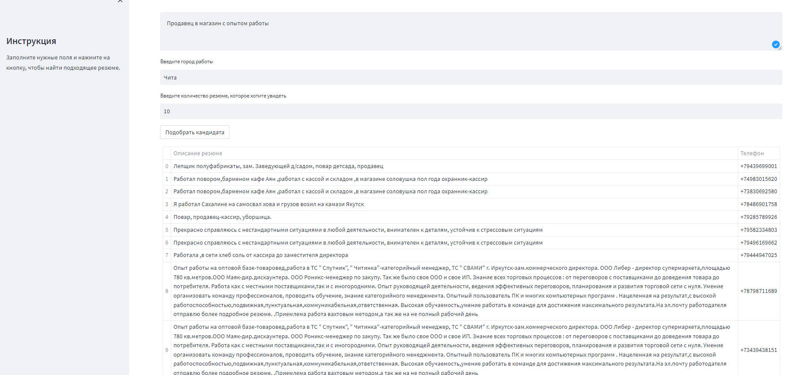

Куросвая работа в Академии Аналитиков Авито: Рекомендательная система для подбора резюме к вакансии

В данном репозитории представлен код с экспериментами по данному проекту, описание моделей, а также сервис для демонстрации работы лучшей модели.

Чтобы запустить сборку:
1. напишите создателям проекта по поводу получения данных и добавьте их в папку data. Или же поулчите готовый контейнер с docker-hub.
2. Если хотите собрать самостоятельно, то зайдите в папку cv_matcher и запустите сборку образа.
```
docker build -t my-app .
```
3. Получив контейнер самостоятельно или скачав с docker-hub, запустите его или из приложения docker-desktop или через команду:
```
docker run -p 8501:8501 my-app
```

Ниже приведен пример работы сервиса.


